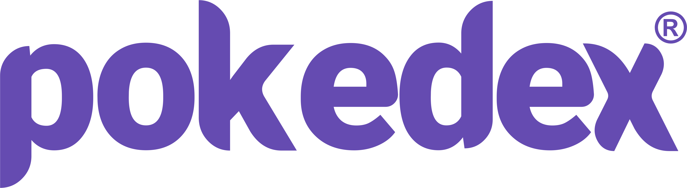

<h1 align="center">
  
</h1>

<p align="center">
  <a href="#description">Description</a>&nbsp;&nbsp;&nbsp;|&nbsp;&nbsp;&nbsp;
  <a href="#requirements">Requirements</a>&nbsp;&nbsp;&nbsp;|&nbsp;&nbsp;&nbsp;
  <a href="#technologies">Technologies</a>&nbsp;&nbsp;&nbsp;|&nbsp;&nbsp;&nbsp;
  <a href="#layout">Layout</a>&nbsp;&nbsp;&nbsp;|&nbsp;&nbsp;&nbsp;
  <a href="#usage">Usage</a>&nbsp;&nbsp;&nbsp;|&nbsp;&nbsp;&nbsp;
  <a href="#demonstration">Demonstration</a>
</p>
<br />
<p align="center">
  
  
  
  
  
  
  
</p>

<p align="center">
  <a href="https://github.com/Lissone/pokedex/issues">Report bug</a>
  ·
  <a href="https://github.com/Lissone/pokedex/issues">Request feature</a>
</p>

<br />

## Description

An incredible pokedex, for you to delve into the pokemon universe and even choose your favorite pokemons and add them to your profile!

Project developed in 5 days of a lot of effort and dedication, the first time I create an api with jwt authentication and web with user login by cookie. It was a big challenge for me, and for sure he will still have many releases.

For the development of this project, a flowchart was created as application documentation on <a href="https://whimsical.com/pokedex-QCLutWg5sqZBwzSR3N7odx" target="_blank">Whimsical</a>.

## Requirements

* [Yarn](https://yarnpkg.com/)
* [Nodejs](https://nodejs.org/en/)

## Technologies

### Backend (Api)
* Express
* Typescript
* Firebase (database)
* Jwt authentication

### Front End
* NextJs
* Typescript
* StyledComponents
* Firebase (Social authentication)
* Nookies
* ESLint (Airbnb config + pessoal rules)
* Prettier

## Layout

You can view the project layout via this <a href="https://www.figma.com/file/tjSrlP5Y0x6rK4rrA5Lqx6/Pokedex?node-id=15%3A271" target="_blank">link</a>. You must have a <a href="https://figma.com" target="_blank">Figma</a> account to access it.

## Usage

You can use this project as a template for another one, or clone it on your pc using the command:

```bash
git clone https://github.com/Lissone/pokedex.git
cd pokedex
```

Install dependencies using:
```bash
yarn
#or
npm run
```

Need to add environment variables in both projects:

```bash
# .\packages\web\.env.local

# FIREBASE
NEXT_PUBLIC_API_KEY=
NEXT_PUBLIC_AUTH_DOMAIN=
NEXT_PUBLIC_DATABASE_URL=
NEXT_PUBLIC_PROJECT_ID=
NEXT_PUBLIC_STORAGE_BUCKET=
NEXT_PUBLIC_MESSAGING_SENDER_ID=
NEXT_PUBLIC_APP_ID=

# DEFAULT
NEXT_PUBLIC_BASE_URL_API=http://localhost:5000/api/v1
NEXT_PUBLIC_SECRET_KEY=
```

```bash
# .\packages\api\.env

# FIREBASE
API_KEY=
AUTH_DOMAIN=
PROJECT_ID=
STORAGE_BUCKET=
MESSAGING_SENDER_ID=
APP_ID=

# POKEAPI
BASE_URL_API=https://pokeapi.co/api/v2

# DEFAULT
APP_URL=http://localhost:5000
PORT=5000
SECRET_KEY=
```

Run api:
```bash
cd .\packages\api\
yarn dev
#or
npm run dev
```

Run web:
```bash
cd .\packages\web\
yarn dev
#or
npm run dev
```

## Demonstration


## License

Distributed under the MIT License. See `LICENSE` for more information.

<h4 align="center">
  Made with ❤️ by <a href="https://github.com/Lissone" target="_blank">Lissone</a>
</h4>

<hr />
